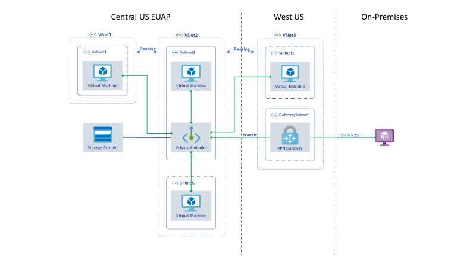

Azure Private Endpoint is the fundamental building block for Private Link in
Azure. It enables Azure resources, like virtual machines (VMs), to communicate
privately with Private Link resources.

Following diagram summarizes various possible connectivity using Private Link in
conjunction with Azure Files NFS

In this article, we will go over mounting an Azure NFS share on an Azure VM over a private link. You will learn how to create a VM on an Azure virtual network, a storage account with an NFS v 4.1 file share and add a Private Endpoint using the Azure portal. Then, you can securely access the Azure Files NFS v 4.1 share from the VM.

In this article
===============

[Sign in to Azure](#sign-in-to-azure)

[Create a VM](#_Toc38912165)

[Virtual network and parameters](#virtual-network-and-parameters)

[Create the virtual network](#create-the-virtual-network)

[Create virtual machine](#create-virtual-machine)

[Create your Private Endpoint](#create-your-private-endpoint)

[Create an NFS Share](#create-an-nfs-share)

[Connect to a VM from the internet](#connect-to-a-vm-from-the-internet)

[Mount NFS Share privately from the VM](#mount-nfs-share-privately-from-the-vm)

[Clean up resources](#clean-up-resources)

Sign in to Azure
================

Sign in to the Azure portal at <https://aka.ms/azurenfs/portal>

Virtual network and parameters
==============================

In this section, you will create virtual network and the subnet to host the VM
that is used to access your Private Link resource.

In this section you'll need to replace the following parameters in the steps
with the information below:

| Parameter                | Value            |
|--------------------------|------------------|
| \<resource-group-name\>  | myResourceGroup  |
| \<virtual-network-name\> | myVirtualNetwork |
| \<region-name\>          | East US          |
| \<IPv4-address-space\>   | 10.1.0.0\\16     |
| \<subnet-name\>          | mySubnet         |
| \<subnet-address-range\> | 10.1.0.0\\24     |

Create the virtual network
==========================

In this section, you'll create a virtual network and subnet.

1.  On the upper-left side of the screen, select **Create a resource \>
    Networking \> Virtual network** or search for **Virtual network** in the
    search box.

2.  In **Create virtual network**, enter or select this information in
    the **Basics** tab:

| Project Details  |                                                                                                                                                  |
|------------------|--------------------------------------------------------------------------------------------------------------------------------------------------|
| Subscription     | Select your Azure subscription                                                                                                                   |
| Resource Group   | Select **Create new**, enter **\<resource-group-name\>**, then select OK, or select an existing **\<resource-group-name\>** based on parameters. |
|                  |                                                                                                                                                  |
| Instance details |                                                                                                                                                  |
| Name             | Enter **\<virtual-network-name\>**                                                                                                               |
| Region           | Select **\<region-name\>**                                                                                                                       |

3.  Select the **IP Addresses** tab or select the **Next: IP Addresses** button
    at the bottom of the page.

4.  In the **IP Addresses** tab, enter this information:

| Setting            | Value                            |
|--------------------|----------------------------------|
| IPv4 address space | Enter **\<IPv4-address-space\>** |

5.  Under **Subnet name**, select the word **default**.

6.  In **Edit subnet**, enter this information:

| Setting              | Value                              |
|----------------------|------------------------------------|
| Subnet name          | Enter **\<subnet-name\>**          |
| Subnet address range | Enter **\<subnet-address-range\>** |

7.  Select **Save**.

8.  Select the **Review + create** tab or select the **Review + create** button.

9.  Select **Create**.

Create virtual machine
======================

1.  On the upper-left side of the screen in the Azure portal, select **Create a
    resource** \> **Compute** \> **Virtual machine**.

2.  In **Create a virtual machine - Basics**, enter or select this information:

| Setting               | Value                                                                                                                                                                                                                                                                                              |
|-----------------------|----------------------------------------------------------------------------------------------------------------------------------------------------------------------------------------------------------------------------------------------------------------------------------------------------|
| PROJECT DETAILS       |                                                                                                                                                                                                                                                                                                    |
| Subscription          | Select your subscription.                                                                                                                                                                                                                                                                          |
| Resource group        | Select **myResourceGroup**. You created this in the previous section.                                                                                                                                                                                                                              |
| INSTANCE DETAILS      |                                                                                                                                                                                                                                                                                                    |
| Virtual machine name  | Enter *myVm*.                                                                                                                                                                                                                                                                                      |
| Region                | Select **East US**.                                                                                                                                                                                                                                                                                |
| Availability options  | Leave the default **No infrastructure redundancy required**.                                                                                                                                                                                                                                       |
| Image                 | Leave the default  **Ubuntu Server 18.04 LTS**                                                                                                                                                                                                                                                     |
| Size                  | Leave the default                                                                                                                                                                                                                                                                                  |
| ADMINISTRATOR ACCOUNT |                                                                                                                                                                                                                                                                                                    |
| Authentication type   | **Password**                                                                                                                                                                                                                                                                                       |
| Username              | Enter a username of your choosing.                                                                                                                                                                                                                                                                 |
| Password              | Enter a password of your choosing. The password must be at least 12 characters long and meet the [defined complexity requirements](https://docs.microsoft.com/en-us/azure/virtual-machines/windows/faq?toc=/azure/virtual-network/toc.json#what-are-the-password-requirements-when-creating-a-vm). |
| Confirm Password      | Reenter password.                                                                                                                                                                                                                                                                                  |
| INBOUND PORT RULES    |                                                                                                                                                                                                                                                                                                    |
| Public inbound ports  | Leave the default **SSH (22)**                                                                                                                                                                                                                                                                     |
| SAVE MONEY            | default                                                                                                                                                                                                                                                                                            |
|                       |                                                                                                                                                                                                                                                                                                    |

3.  Select **Next: Disks**.

4.  In **Create a virtual machine - Disks**, leave the defaults and
    select **Next: Networking**.

5.  In **Create a virtual machine - Networking**, select this information:

| Setting              | Value                                         |
|----------------------|-----------------------------------------------|
| Virtual network      | Leave the default **MyVirtualNetwork**.       |
| Address space        | Leave the default **10.1.0.0/24**.            |
| Subnet               | Leave the default **mySubnet (10.1.0.0/24)**. |
| Public IP            | Leave the default **(new) myVm-ip**.          |
| Public inbound ports | Select **Allow selected ports**.              |
| Select inbound ports | Select **SSH (22)**                           |
|                      |                                               |

6.  Select **Review + create**. You're taken to the **Review + create** page
    where Azure validates your configuration.

7.  When you see the **Validation passed** message, select **Create**.

Create your Private Endpoint
============================

In this section, you will create a private storage account using a Private
Endpoint to it.

1.  On the upper-left side of the screen in the Azure portal, select **Create a
    resource** \> **Storage** \> **Storage account**.

2.  In **Create storage account - Basics**, enter or select this information:

| Setting              | Value                                                                  |
|----------------------|------------------------------------------------------------------------|
| PROJECT DETAILS      |                                                                        |
| Subscription         | Select your subscription.                                              |
| Resource group       | Select **myResourceGroup**. You created this in the previous section.  |
| INSTANCE DETAILS     |                                                                        |
| Storage account name | Enter *mystorageaccount*. If this name is taken, create a unique name. |
| Region               | Select **Central US EUAP**.                                            |
| Performance          | Select  **Premium**.                                                   |
| Account kind         | Select **File Storage**.                                               |
| Replication          | Select **Locally-redundant storage (LRS)**.                            |
|                      |                                                                        |

3.  Select **Next: Networking**.

4.  In **Create a storage account - Networking**, connectivity method,
    select **Private Endpoint**.

5.  In **Create a storage account - Networking**, underneath **Private
    Endpoints,** select **+Add**.

6.  In **Create Private Endpoint**, enter or select this information:

| Setting                         | Value                                                                 |
|---------------------------------|-----------------------------------------------------------------------|
| PROJECT DETAILS                 |                                                                       |
| Subscription                    | Select your subscription.                                             |
| Resource group                  | Select **myResourceGroup**. You created this in the previous section. |
| Location                        | Select **East US**.                                                   |
| Name                            | Enter *myPrivateEndpoint*.                                            |
| Storage sub-resource            | Leave the default **File**.                                           |
| NETWORKING                      |                                                                       |
| Virtual network                 | Select *MyVirtualNetwork* from resource group *myResourceGroup*.      |
| Subnet                          | Select *mySubnet*.                                                    |
| PRIVATE DNS INTEGRATION         |                                                                       |
| Integrate with private DNS zone | Leave the default **Yes**.                                            |
| Private DNS zone                | Leave the default **(New) privatelink.file.core.windows.net**.        |
|                                 |                                                                       |

7.  Select **OK**.

8.  Select **Next: Advanced**

9.  Next to **Secure Transfer Enabled**, select **Disable.**

10. Select **Review + create**. You're taken to the **Review + create** page
    where Azure validates your configuration.

11. When you see the **Validation passed** message, select **Create**.

12. Browse to the storage account resource that you just created.

Create an NFS Share
===================

In this section, you will create an NFS File share.

1.  Navigate to *mystorageaccount*. In the portal's search bar,
    enter *mystorageaccount*

2.  Select **File Shares**

3.  To create a file share Select **+File Share** on the top

4.  In **New File Share**, enter or select this information:

| Setting              | Value                                             |
|----------------------|---------------------------------------------------|
| Name                 | Enter *mynfsshare* or a share name of your choice |
| Provisioned capacity | Leave default **1024**                            |
| Protocol             | Select **NFS**                                    |
| Root Squash          | Leave the default **No Root Squash**              |

5.  Select **Create**.

Connect to a VM from the internet
=================================

Connect to the VM *myVm* from the internet as follows:

1.  In the portal's search bar, enter *myVm*.

2.  To connect the Linux-based VM, you need a secure shell protocol (SSH)
    client. This discussion will use the
    free [PuTTY](https://www.ssh.com/ssh/putty/) SHH terminal.

3.  Go to the [Azure portal](https://ms.portal.azure.com/). Search for and
    select **Virtual machines**.

4.  Select the VM you want to connect to.

5.  Start the VM if it isn't already running.

6.  n VM.

7.  Open the PuTTY application.

8.  In the PuTTY Configuration dialog, enter the IP address or DNS name of your
    VM.

9.  Click **Open** to open a PuTTY terminal.

10. You may receive a certificate warning during the sign-in process. If you
    receive a certificate warning, select **Yes** or **Continue**.

11. When you're prompted, enter the account name and password of your Linux VM
    account.

Mount NFS Share privately from the VM
=====================================

In this section, you will connect privately to the storage account using the
Private Endpoint.

1.  In the Remote Desktop of *myVM*, enter 

| nslookup mystorageaccount.file.core.windows.net  |
|--------------------------------------------------|

>   You'll receive a message similar to this:

| Server: 168.63.129.16 Address: 168.63.129.16 Non-authoritative answer: Name: mystorageaccount.privatelink.file.core.windows.net Address: 10.0.0.5 Aliases: mystorageaccount.file.core.windows.net |
|---------------------------------------------------------------------------------------------------------------------------------------------------------------------------------------------------|

1.  In the portal's search bar, enter *mystorageaccount*.

2.  Select **File Shares**

3.  Select *mynfsshare*

4.  Copy the command from the clipboard

5.  Paste the command on a notepad

6.  Replace *mystorageaccount.file.core.windows.net with
    mystorageaccount.privatelink.file.core.windows.net*

| sudo apt update |
|-----------------|

>   sudo apt install nfs-common

>   sudo mkdir -p /mnt/mystorageaccount/mynfsshare

>   sudo mount -t nfs
>   mystorageaccount.privatelink.file.core.windows.net:/mystorageaccount/mynfsshare
>   /mnt/mystorageaccount/mynfsshare -o vers=4,minorversion=1,sec=sys

1.  Run the command on the VM

2.  Run df to see that amount of free space on the file system

Clean up resources
==================

When you're done using the Private Endpoint, storage account and the VM, delete
the resource group and all of the resources it contains:

1.  Enter *myResourceGroup* in the **Search** box at the top of the portal and
    select *myResourceGroup* from the search results.

2.  Select **Delete resource group**.

3.  Enter *myResourceGroup* for **TYPE THE RESOURCE GROUP NAME** and
    select **Delete**.
